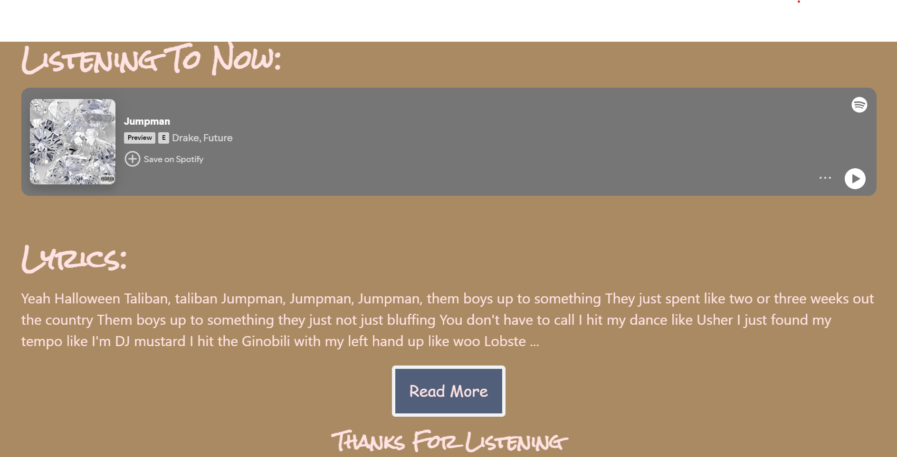

# Song Searcher

## Description

For our project, we created a website that allows users to search for an artist and their song, presenting both the song and its lyrics. Our project utilizes both the Spotify API and a lyrics API. We chose Pico CSS as our CSS framework because it offers a minimal yet stylish design.

## Table of Contents

- [Usage](#usage)
- [Credits](#credits)
- [License](#license)

## Usage

<a href="https://github.com/JoseGuache/Project1.git">Github Repo</a>

<a href="https://joseguache.github.io/Project1/">Live Page</a>

## Credits

<a href="https://picocss.com/">Our CSS Framework</a>

<a href="https://rapidapi.com/Glavier/api/spotify23/playground/apiendpoint_1dc51f1b-a2c6-4f9a-9c6c-32019c7301b2">Our Music API</a>

<a href="https://www.postman.com/cs-demo/public-rest-apis/request/algu09l/lyrics-search?tab=overview">Our Lyrics API</a>

## License

